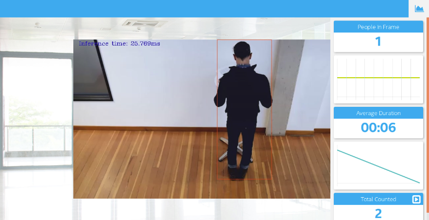

# Deploy a People Counter App at the Edge

| Details            |              |
|-----------------------|---------------|
| Programming Language: |  Python 3.5 or 3.6 |



## What it Does

The people counter application will demonstrate how to create a smart video IoT solution using Intel® hardware and software tools. The app will detect people in a designated area, providing the number of people in the frame, average duration of people in frame, and total count.

## How it Works

The counter will use the Inference Engine included in the Intel® Distribution of OpenVINO™ Toolkit. The model used should be able to identify people in a video frame. The app should count the number of people in the current frame, the duration that a person is in the frame (time elapsed between entering and exiting a frame) and the total count of people. It then sends the data to a local web server using the Paho MQTT Python package.

You will choose a model to use and convert it with the Model Optimizer.


## Requirements

### Hardware

* 6th to 10th generation Intel® Core™ processor with Iris® Pro graphics or Intel® HD Graphics.
* OR use of Intel® Neural Compute Stick 2 (NCS2)
* OR Udacity classroom workspace for the related course

### Software

*   Intel® Distribution of OpenVINO™ toolkit 2019 R3 release
*   Node v6.17.1
*   Npm v3.10.10
*   CMake
*   MQTT Mosca server
  
        
## Setup

### Install Intel® Distribution of OpenVINO™ toolkit

Utilize the classroom workspace, or refer to the relevant instructions for your operating system for this step.

- [Linux/Ubuntu](./linux-setup.md)
- [Mac](./mac-setup.md)
- [Windows](./windows-setup.md)

### Install Nodejs and its dependencies

Utilize the classroom workspace, or refer to the relevant instructions for your operating system for this step.

- [Linux/Ubuntu](./linux-setup.md)
- [Mac](./mac-setup.md)
- [Windows](./windows-setup.md)

### Install npm

There are three components that need to be running in separate terminals for this application to work:

-   MQTT Mosca server 
-   Node.js* Web server
-   FFmpeg server
     
From the main directory:

* For MQTT/Mosca server:
   ```
   cd webservice/server
   npm install
   ```

* For Web server:
  ```
  cd ../ui
  npm install
  ```
  **Note:** If any configuration errors occur in mosca server or Web server while using **npm install**, use the below commands:
   ```
   sudo npm install npm -g 
   rm -rf node_modules
   npm cache clean
   npm config set registry "http://registry.npmjs.org"
   npm install
   ```

## What model to use

It is up to you to decide on what model to use for the application. You need to find a model not already converted to Intermediate Representation format (i.e. not one of the Intel® Pre-Trained Models), convert it, and utilize the converted model in your application.

Note that you may need to do additional processing of the output to handle incorrect detections, such as adjusting confidence threshold or accounting for 1-2 frames where the model fails to see a person already counted and would otherwise double count.

**If you are otherwise unable to find a suitable model after attempting and successfully converting at least three other models**, you can document in your write-up what the models were, how you converted them, and why they failed, and then utilize any of the Intel® Pre-Trained Models that may perform better.

## Run the application

From the main directory:

### Step 1 - Start the Mosca server

```
cd webservice/server/node-server
node ./server.js
```

You should see the following message, if successful:
```
Mosca server started.
```

### Step 2 - Start the GUI

Open new terminal and run below commands.
```
cd webservice/ui
npm run dev
```

You should see the following message in the terminal.
```
webpack: Compiled successfully
```

### Step 3 - FFmpeg Server

Open new terminal and run the below commands.
```
sudo ffserver -f ./ffmpeg/server.conf
```

### Step 4 - Run the code

Open a new terminal to run the code. 

#### Setup the environment

You must configure the environment to use the Intel® Distribution of OpenVINO™ toolkit one time per session by running the following command:
```
source /opt/intel/openvino/bin/setupvars.sh -pyver 3.5
```

You should also be able to run the application with Python 3.6, although newer versions of Python will not work with the app.

#### Running on the CPU

When running Intel® Distribution of OpenVINO™ toolkit Python applications on the CPU, the CPU extension library is required. This can be found at: 

```
/opt/intel/openvino/deployment_tools/inference_engine/lib/intel64/
```

*Depending on whether you are using Linux or Mac, the filename will be either `libcpu_extension_sse4.so` or `libcpu_extension.dylib`, respectively.* (The Linux filename may be different if you are using a AVX architecture)

Though by default application runs on CPU, this can also be explicitly specified by ```-d CPU``` command-line argument:

```
python main.py -i resources/Pedestrian_Detect_2_1_1.mp4 -m your-model.xml -l /opt/intel/openvino/deployment_tools/inference_engine/lib/intel64/libcpu_extension_sse4.so -d CPU -pt 0.6 | ffmpeg -v warning -f rawvideo -pixel_format bgr24 -video_size 768x432 -framerate 24 -i - http://0.0.0.0:3004/fac.ffm
```
If you are in the classroom workspace, use the “Open App” button to view the output. If working locally, to see the output on a web based interface, open the link [http://0.0.0.0:3004](http://0.0.0.0:3004/) in a browser.

#### Running on the Intel® Neural Compute Stick

To run on the Intel® Neural Compute Stick, use the ```-d MYRIAD``` command-line argument:

```
python3.5 main.py -d MYRIAD -i resources/Pedestrian_Detect_2_1_1.mp4 -m your-model.xml -pt 0.6 | ffmpeg -v warning -f rawvideo -pixel_format bgr24 -video_size 768x432 -framerate 24 -i - http://0.0.0.0:3004/fac.ffm
```

To see the output on a web based interface, open the link [http://0.0.0.0:3004](http://0.0.0.0:3004/) in a browser.

**Note:** The Intel® Neural Compute Stick can only run FP16 models at this time. The model that is passed to the application, through the `-m <path_to_model>` command-line argument, must be of data type FP16.

#### Using a camera stream instead of a video file

To get the input video from the camera, use the `-i CAM` command-line argument. Specify the resolution of the camera using the `-video_size` command line argument.

For example:
```
python main.py -i CAM -m your-model.xml -l /opt/intel/openvino/deployment_tools/inference_engine/lib/intel64/libcpu_extension_sse4.so -d CPU -pt 0.6 | ffmpeg -v warning -f rawvideo -pixel_format bgr24 -video_size 768x432 -framerate 24 -i - http://0.0.0.0:3004/fac.ffm
```

To see the output on a web based interface, open the link [http://0.0.0.0:3004](http://0.0.0.0:3004/) in a browser.

**Note:**
User has to give `-video_size` command line argument according to the input as it is used to specify the resolution of the video or image file.

## A Note on Running Locally

The servers herein are configured to utilize the Udacity classroom workspace. As such,
to run on your local machine, you will need to change the below file:

```
webservice/ui/src/constants/constants.js
```

The `CAMERA_FEED_SERVER` and `MQTT_SERVER` both use the workspace configuration. 
You can change each of these as follows:

```
CAMERA_FEED_SERVER: "http://localhost:3004"
...
MQTT_SERVER: "ws://localhost:3002"
```


## Explaining Custom Layers

The Model Optimizer of the OpenVINO Toolkit has a list of supported layers that it can optimize and run, but in certain rare cases there may be layers that are not supported by the Model Optimizer and these are classified as the Custom Layers. 
In order to convert the custom layer into IR, you have to register those layers as extensions to the Model Optimizer, which enables it to create a valid and optimized IR. In this project we use a cpu-extension in order to handle the unsupported custom layers. Some layers could be unsupported due to the hardware and in these cases the extensions add support to handle these layers and offload some of the work to the CPU.

## Model Selection

For this project I identified the ssd_mobilenet_v2_coco¬_ 2018_03_29 as the most suitable model for this application for reasons mentioned in the ‘Model Research’ section below. The steps involved in converting this model into an intermediate representation (IR) is as follows:
1. Download the model:
```
wget http://download.tensorflow.org/models/object_detection/ssd_mobilenet_v1_coco_2018_01_28.tar.gz
```

2. Extract the contents of the tar.gz file:
```
tar -xvf ssd_mobilenet_v1_coco_2018_01_28.tar.gz
```

3. Go into the directory of the extracted folder:
```
cd ssd_mobilenet_v1_coco_2018_01_28.tar.gz
```

4. Convert the tensorflow model to IR using the model optimizer python script:
```
python /opt/intel/openvino/deployment_tools/model_optimizer/mo_tf.py --input_model
frozen_inference_graph.pb --tensorflow_object_detection_api_pipeline_config pipeline.config                           --reverse_input_channel --tensorflow_use_custom_operations_config
/opt/intel/openvino/deployment_tools/model_optimizer/extensions/front/tf/ssd_v2_support.json 
```

5. Command to run the application:
```
python main.py -i resources/Pedestrian_Detect_2_1_1.mp4 -m ssd_mobilenet_v2_coco_2018_03_29/frozen_inference_graph.xml -l /opt/intel/openvino/deployment_tools/inference_engine/lib/intel64/libcpu_extension_sse4.so -d CPU -pt 0.25 | ffmpeg -v warning -f rawvideo -pixel_format bgr24 -video_size 768x432 -framerate 24 -i - http://0.0.0.0:3004/fac.ffm
```


## Comparing Model Performance

The chosen model is the ssd_mobilenet_v2_coco_2018_03_29 model. The comparisons of the model before and after conversion to IR were based on accuracy, model size and inference times.
1. Accuracy: On observation the accuracies of the model before and after conversion were similar and detection was  made with approximately the same confidence levels.
2. Size: Pre-conversion (frozen_inference_graph.pb) size = 69,688,296 bytes, Post-conversion (frozen_ inference_graph.xml + frozen_ inference_graph.bin) size = 67,272,876 bytes + 111,552 bytes = 67,384,428 bytes 
3. Inference time: Pre-converted tensorflow model approximate inference time was 93 ms. IR model had an approximate inference time of 69 ms.


## Assess Model Use Cases

Some potential use cases of the people counter app are,
1. At current times, a useful use-case would be in public buildings to ensure that the number of people do not exceed the maximum capacity in order to ensure a safe environment. With some modifications to the app, we could also check to see if people are maintaining a distance of six feet between them.
2. The application could be used in malls and schools to make sure no one is left behind before closing.
3. Another use-case could be at amusement park rides to count the number of people waiting in queues and estimate a waiting time for each ride, which can then be checked in a mobile application.

## Assess Effects on End User Needs

**Lighting:** is an important factor in detecting people in an environment. If the area under consideration is either too bright or too dark, it would make it difficult to identify edges in the frame, hence greatly reduce the accuracy of detection.
**Model Accuracy:** Models with higher accuracy are more beneficial, but usually more complex and resource heavy models provide more accurate results. If the user has resource constraints (depends on the edge device used), a model with lower accuracy could still work well with some additional modification to handle undetected frames as is done with this project.
**Image size and camera focal length:** The effects of these parameters greatly depend on the size and focal length of the images used during training of the model. Variations in these two parameters from the norm would reduce the accuracy of the model, leading to more missed detections.


## Model Research

In investigating potential people counter models, I tried each of the following three models:
**Model 1:** faster_rcnn_inception_v2_coco_2018_01_28
This model performed well in terms of detecting people in the video accurately, but the inference time for this model was really high, hence the video was slowed down quite a bit and could not be observed in real time.
Model link: http://download.tensorflow.org/models/object_detection/faster_rcnn_inception_v2_coco_2018_01_28.tar.gz

Command to convert to IR:
```
python /opt/intel/openvino/deployment_tools/model_optimizer/mo.py --input_model faster_rcnn_inception_v2_coco_2018_01_28/frozen_inference_graph.pb --tensorflow_object_detection_api_pipeline_config pipeline.config --reverse_input_channels --tensorflow_use_custom_operations_config /opt/intel/openvino/deployment_tools/model_optimizer/extensions/front/tf/faster_rcnn_support.json
```

**Model 2:** ssd_inception_v2_coco_2018_01_28
This model was not very accurate in detecting people especially when they were stationary at the table. Even after reducing the probability threshold values to very low values, it was unable to detect the person in certain cases.
Model Link: http://download.tensorflow.org/models/object_detection/ssd_inception_v2_coco_2018_01_28.tar.gz
Command to convert to IR:
```
python /opt/intel/openvino/deployment_tools/model_optimizer/mo.py --input_model ssd_inception_v2_coco_2018_01_28/frozen_inference_graph.pb --tensorflow_object_detection_api_pipeline_config pipeline.config --reverse_input_channels --tensorflow_use_custom_operations_config /opt/intel/openvino/deployment_tools/model_optimizer/extensions/front/tf/ssd_v2_support.json
```

**Model 3:** ssd_mobilenet_v2_coco¬_ 2018_03_29
This model was the most suitable for this application because it had fast inference times and it was more accurate than the ssd_inception_v2_coco_2018_01_28 model. With some modifications to the code to account for some lost frames, it worked really well, hence I used this model for this application. A probability threshold value of 0.25 was used for optimal results.
Model Link: http://download.tensorflow.org/models/object_detection/ssd_mobilenet_v2_coco_2018_03_29.tar.gz

| Model                                     | Size (bytes)        | Approx. Inference time (ms) |
| ------------------------------            |:-------------------:| ---------------------------:|
| faster_rcnn_inception_v2_coco_2018_01_28  | 53,229,380          | 852                         |
| ssd_inception_v2_coco_2018_01_28          | 100,074,252         | 156                         |
| ssd_mobilenet_v2_coco¬_ 2018_03_29        | 67,272,876          | 69                          |